 

**Building reliable systems · Cloud-native infrastructure · Open source**

 

---

## 👋 About me

**DevOps Engineer** focused on building **reliable, scalable and maintainable** software and infrastructure.

I enjoy designing **backend systems**, **cloud-native architectures** and **developer tools** that solve real-world problems — from CI/CD pipelines and Infrastructure as Code to monitoring platforms and observability stacks.

**I'm especially interested in:**

- 🚀 **Backend & platform engineering** — APIs, data models, production-ready services
- ☁️ **Cloud infrastructure** — AWS · Azure · GCP · multi-cloud environments
- 🔧 **DevOps & automation** — CI/CD · Terraform · GitOps · IaC
- 📊 **Observability & reliability** — Grafana · Prometheus · alerting · status pages
- 🧩 **Products from idea to production** — open source · self-hosted · developer-first workflows

---

## 📊 GitHub activity

  

---

## 👻 Featured project — GhostWatch

### [GhostWatch](https://github.com/jaimegcaam/ghostwatch) — Self-hosted Monitoring Platform

**GhostWatch** is an open-source monitoring platform that helps teams run **uptime checks**, manage **alerts** and publish **public status pages** — while keeping **full control** of their infrastructure.

The goal is simple: make reliable monitoring **accessible**, **transparent** and **easy to self-host**.

<table>
  <tr>
    <td width="50%" align="center">
      
       <b>Dashboard</b> — uptime, probes & alerts
    </td>
    <td width="50%" align="center">
      
       <b>Status page</b> — public service health
    </td>
  </tr>
</table>

**Key features**

- 🔎 Website & service health checks
- 🚨 Alerting system (Slack, Discord, email)
- 📊 Public status pages with custom domains
- 🐳 Docker-first deployment — up in under 5 minutes
- 🔐 Self-hosted architecture — your data stays yours
- ⚡ Simple, developer-friendly workflow

Built with **Next.js**, **PostgreSQL** and **Docker**. Focused on reliability, maintainability and real-world usage.

---

## 🛠 Tech stack

<table>
  <tr>
    <td valign="top" width="50%">
      <strong>Languages</strong> 
      TypeScript · JavaScript · Python · C# / .NET  
      <strong>Backend &amp; data</strong> 
      Node.js · REST APIs · PostgreSQL · Database design  
      <strong>Frontend</strong> 
      React · Next.js · Tailwind CSS
    </td>
    <td valign="top" width="50%">
      <strong>Cloud &amp; platforms</strong> 
      AWS · Azure · Google Cloud · Kubernetes  
      <strong>DevOps &amp; automation</strong> 
      Docker · CI/CD · Terraform · Bicep · GitOps · Azure DevOps · Jenkins  
      <strong>Observability</strong> 
      Grafana · Prometheus · Application Insights · alerting &amp; SLOs
    </td>
  </tr>
</table>

---

## 📌 Current focus

- 🏗 Building and improving **open-source** projects like GhostWatch
- 📈 Improving **software reliability** and **observability**
- ☁️ Exploring **cloud-native** technologies and GitOps workflows
- 📚 Learning and sharing through **practical, production-grade** projects

---

**📫 Let's connect**

 

  

Madrid, Spain · Open to interesting projects and collaborations

